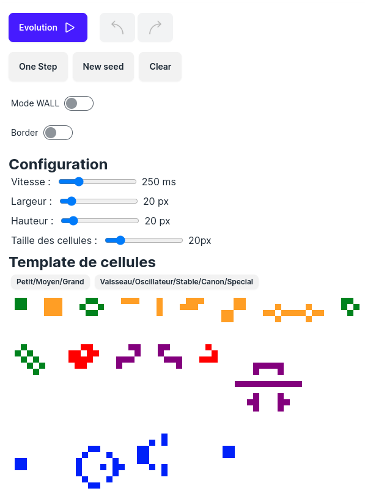
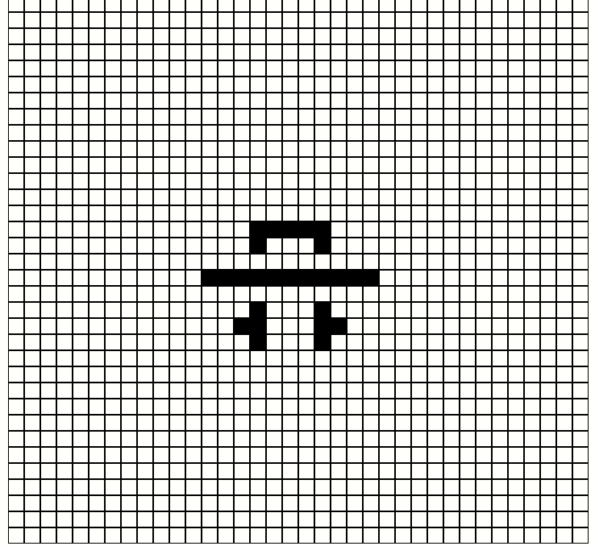
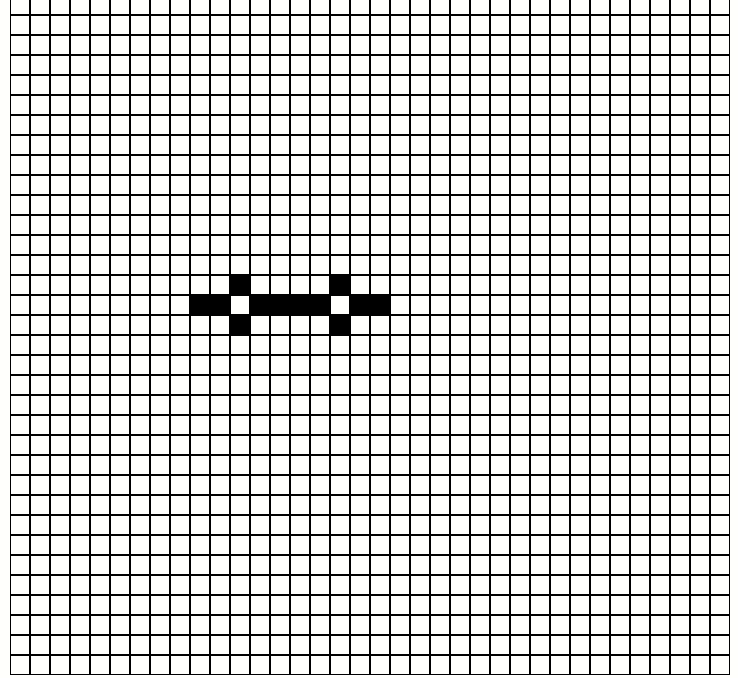
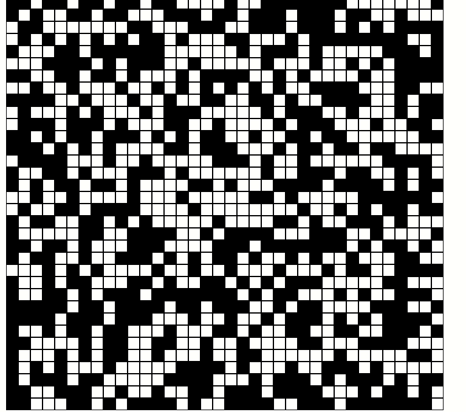

# Jeu de la vie

Le Jeu de la Vie (ou Game of Life en anglais) est un automate cellulaire, un modèle mathématique pour un univers de cellules sur une grille bidimensionnelle infinie. Il a été inventé par le mathématicien britannique John Horton Conway en 1970.

## Pour jouer au jeu

- Cloner ce git
- npm i
- npm run dev
- Aller sur localhost:3000 depuis votre navigateur

## Configuration du jeu

## Exemple sympas

